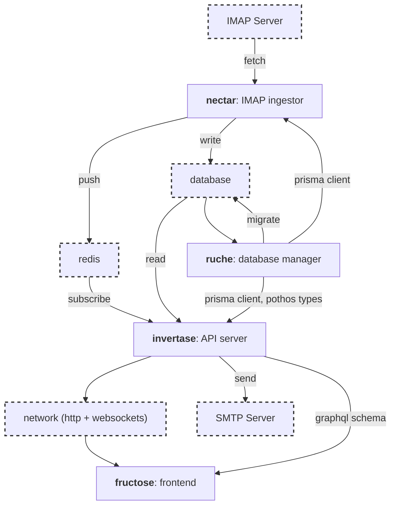

# miel's packages

```mermaid
graph TD
  style imap stroke:#333,stroke-width:2px,stroke-dasharray: 5,5;
  style redis stroke:#333,stroke-width:2px,stroke-dasharray: 5,5;
  style db stroke:#333,stroke-width:2px,stroke-dasharray: 5,5;
  style network stroke:#333,stroke-width:2px,stroke-dasharray: 5,5;
  style smtp stroke:#333,stroke-width:2px,stroke-dasharray: 5,5;

  db["database"]
  redis["redis"]
  imap["IMAP Server"]
  network["network (http + websockets)"]
  smtp["SMTP Server"]

  ruche["<b>ruche</b>: database manager"]
  nectar["<b>nectar</b>: IMAP ingestor"]
  invertase["<b>invertase</b>: API server"]
  fructose["<b>fructose</b>: frontend"]

  imap -->|fetch| nectar
  nectar -->|write| db
  nectar -->|push| redis

  db --> ruche
  ruche -->|migrate| db

  redis -->|subscribe| invertase
  db -->|read| invertase
  invertase -->|send| smtp

  invertase --> network --> fructose
  ruche -->|prisma client, pothos types| invertase
  ruche -->|prisma client| nectar
  invertase -->|graphql schema| fructose

```
